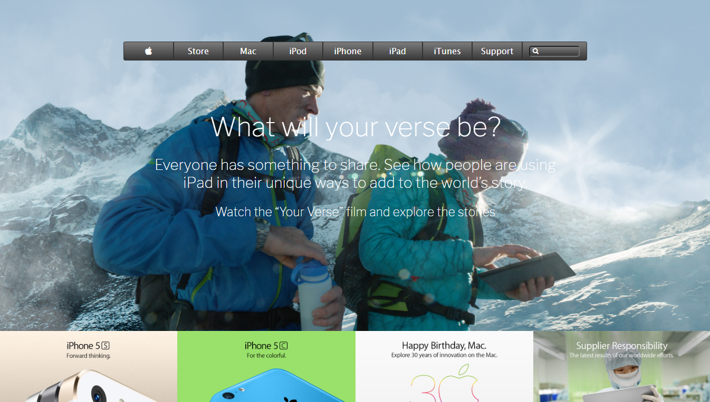

# Old Apple's Home page Clone

In this project we cloned an old website of Apple. We did the following: 

- Have background photos.
- Using linear gradients in the navbar.

## Built With

- HTML/CSS,
- VISUAL STUDIO CODE
- GIT
- Linter

## Live Demo

[Live Demo Link](https://raw.githack.com/Blaise-Shyaka/Apple-homepage-clone/homepage/index.html)

## Setup

- Git clone https://github.com/Blaise-Shyaka/Apple-homepage-clone.git
- Open index.html in a browser.

## Authors

👤 **Rafael Cavalheiro**

- Github: [@Rgcavalheiro](https://github.com/rgcavalheiro)
- Twitter: [@twitterhandle](https://twitter.com/rgcavalheiro)
- Linkedin: [linkedin](https://www.linkedin.com/in/rafael-cavalheiro-00415b94/)

👤 **Blaise Pascal Shyaka**

- Github: [@Blaise-Shyaka](https://github.com/Blaise-Shyaka)
- Twitter: [@blaiseshyaka95](https://twitter.com/blaiseshyaka95)
- Linkedin: [linkedin](https://www.linkedin.com/in/blaise-pascal-shyaka-b1340b111/)

## 🤝 Contributing

Contributions, issues and feature requests are welcome!

Feel free to check the [issues page](issues/).

## Show your support

Give a ⭐️ if you like this project!

